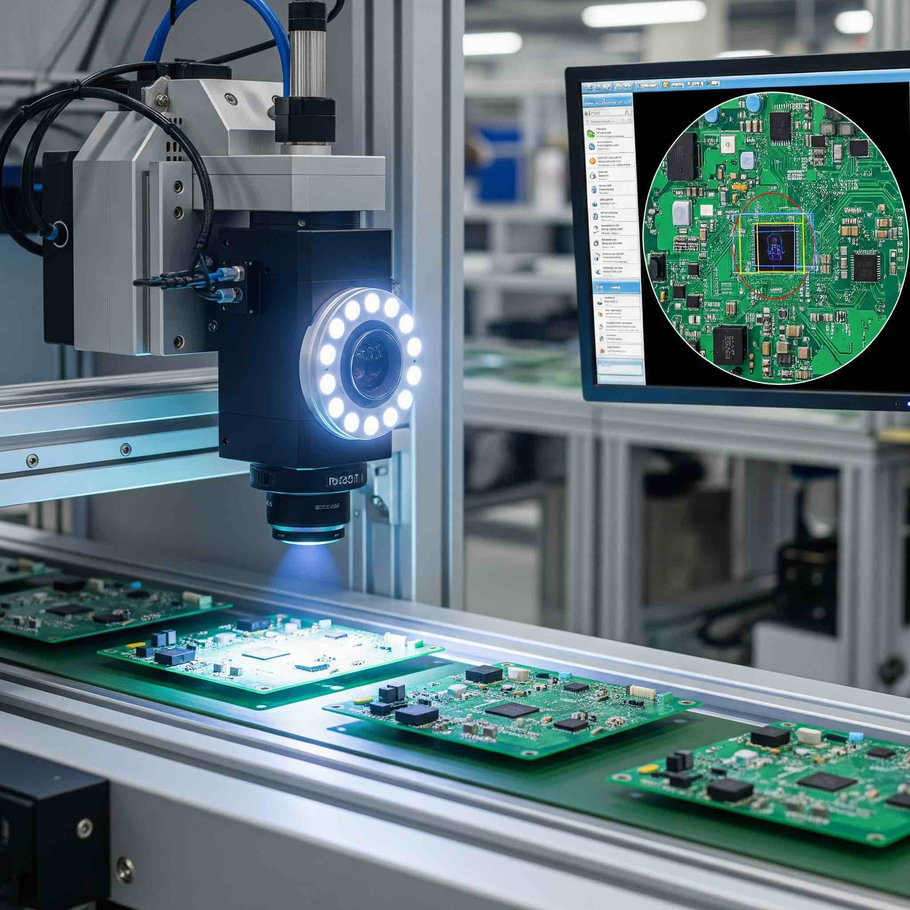

# Vision AI Demos for IMX500 & Cumulocity  🚀

This repository contains a collection of Vision AI demonstrations designed to run on an **IMX500-based Raspberry Pi AI Camera** and integrate with the **Cumulocity platform**.

Each demo includes:
* An AI model
* A custom AI application (`.deb`) to run on the Raspberry Pi
* One or more Analytics Builder model files (`.json`) for data processing in Cumulocity
* Example dashboard screenshots for visualization

Note that the camera can only run one model at a time, but it can run multiple AI applications at the same time. Therefore, the examples that share the same model can be also run at the same time.

---

## 📚 Available Demos

Below is an overview of the available demos. Click the link for specific details about each implementation, its purpose, and any unique setup requirements.
After the table you will find the general installation instructions which are the same for each demo.

| Demo | Image | Description | Link |
| --- | --- | --- | --- |
| **High-Vis Vest detection** |  | Detects people in the camera's field of view in real-time and checks for high-vis vests. An example of a PPE verifcation. | [Details](./high-vis-detection/README.md) |
| **Solder quality classification** |  | Classifies if a PCB is soldered correctly or not. An example of a visual quality check resulting in OEE calculation. | [Details](./solder-quality/README.md) |

---

## 🛠️ Prerequisites

Before you begin, ensure you have the following:

* **Hardware:** A Raspberry Pi with a Raspberry Pi AI Camera (based on IMX500).
* **Software:**
    * A Cumulocity IoT tenant with administrator credentials.
    * The Vision AI UI extension for Cumulocity Devicemangemen (can be downloaded from the release binaries in Github). 
    * Your Raspberry Pi is flashed with a supported OS and is connected to the internet.
    * The Raspberry Pi AI camera is connected and recognized (you can check the [Raspberry Pi documentation](https://www.raspberrypi.com/documentation/accessories/ai-camera.html))

---

## ⚙️ General Installation and Setup

These steps are common for all demos in this repository.

### 1. Prepare the device and connect it to Cumulocity

First, you need to connect your Raspberry Pi to your Cumulocity tenant.
We will use [thin-edge.io](https://thin-edge.io/) for that, which will also give us all the Devicemanagement capabilities of Cumulocity.

* Install thin-edge.io on your Raspberry Pi following this documentation: https://thin-edge.github.io/thin-edge.io/install/
* Afterwards connect it to Cumulocity following this documentation: https://thin-edge.github.io/thin-edge.io/start/connect-c8y/
* After a few moments, your device will appear in the **Device Management** application in Cumulocity.
* Install the thin-edge plugin for Vision AI. You can download it from the release binaries in Github (the installation prodcedure is the same as described below for the AI application).
* After installation you should the a child-device in Cumulocity under your connected Raspberry Pi.

### 2. Install the AI Application

Each demo has a specific Debian package (`.deb`) that runs the AI inference on the device. All files can be found as pre-build packages attached to the release.

*  **Log in to your Cumulocity tenant.**
*  Navigate to the **Devicemanagement** application.
*  In the left-hand menu, go to **Management > Software Repository**.
*  Click **Add software** in the top-right corner.
*  As software type you should use `apt` and as the version it has to match the version of the debian package (see the file DEBIAN/control)
*  Drag and drop your `.deb` file or browse to select it.
*  Once uploaded, the software will be available in your tenant for deployment to devices.
*  Finally go to your (Raspberry Pi) device in Cumulocity and install the app via the software tab

### 3. Deploy the AI Model

The AI model must be deployed to the device via the Cumulocity platform. All the models are attached to the binaries of the release in Github.
With Cumulocity please upload the model as-is (as a ZIP file).

* In the Cumulocity UI, navigate to the **Devicemanagement** application.
* In the left-hand menu, go to **Management > AI Model Repository**.
* Click **Add model** in the top-right corner.
* Drag and drop your model file or browse to select it.
* Once the model is uploaded navigate to your device and find the child-device that represents the camera.
* Go to the tab **AI Model**, click **Install modell**, select your model and click **Install**.
* Once the model has be successfully downloaded to the camera you can activate it with the toggle from the same UI.

### 4. Import the Analytics Builder Flow

The Analytics Builder flow processes the data that is generated by the AI application and creates statistics for the use case.

* Navigate to the **Analytics Builder** application in Cumulocity.
* On the top right, click **Import**.
* Select and upload the `.json` model file provided in the demo folder.
* All models of the examples include parameters that need to be filled out. In order to activate it on the imported model click **Instances** and then **New Instace**. This will add a new line to the table of instances. Please see the README of each demo for detailed explanation of how to populate the parameters.

### 5. Create a Dashboard

Using the processed data, you can create a dashboard to visualize the results. Each example will include an explanation of what data is generated by the camera and by the additional analytics. Additionally there is a screenshot of an example dashboard.

---

## 🏗️ Building from Source (Optional)

If you wish to modify and build the AI applications yourself, instructions are provided within each demo's respective directory. You will typically need a Python developer environment.

## 🤝 Contributing

Contributions are welcome! Please feel free to submit a pull request or open an issue.

# Licensing

Copyright 2025-present Cumulocity GmbH

This project is licensed under the Apache 2.0 license - see https://www.apache.org/licenses/LICENSE-2.0

--- 

These tools are provided as-is and without warranty or support. They do not constitute part of the product suite. Users are free to use, fork and modify them, subject to the license agreement. While we welcome contributions, we cannot guarantee to include every contribution in the main project.

For more information you can Ask a Question in the [Cumulocity Tech Community](https://techcommunity.cumulocity.com/). Contact us there if you have any questions.
