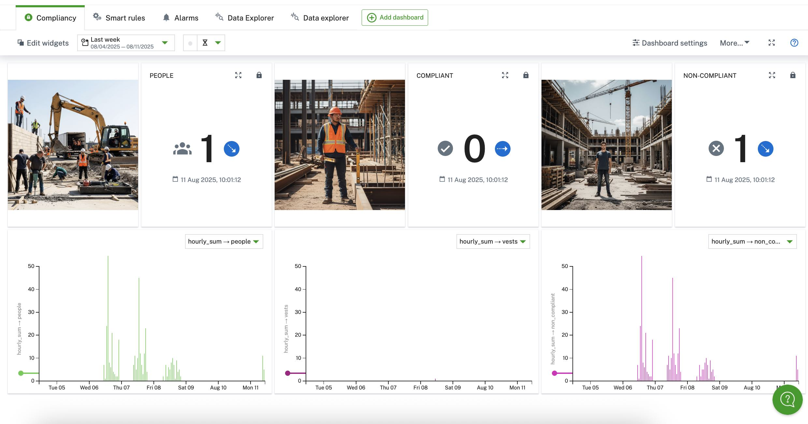

# High-Vis Detection AI App

## 🤖 Model

The model for this demo is a detection model that recognized people and high-vis vests.

## 📚 Installing the Analytics

For this example the analytics flow has only the camera as a parameter. Ensure that you select not the Raspberry Pi but the camera child device (as this is where the data is generated).

## The Data

### Data of the camera

The AI application will track objects while they are in the FoV. When an object (person or vest) enters the FoV it will send a measurement with the amount of newly entered people and vests to Cumulocity (unless two objects enter at the exact same frame the measurement values are therefore 0 and 1).
There is no logic to "remember" objects if they leave the FoV, therefore if you leave the FoV and re-enter it you are counted again.
Data is only sent if an object enters. There is a debouncing to ensure the object is at least a certain amount of frames inside before counting it.

| Data point | Explanation | Fragment => Series |
| --- | --- | --- |
| **People** | The amount of people entering the FoV in that frame. | people => people |
| **Vests** | The amount of vests entering the FoV in that frame. | vests => vests |

### Data of the analytics

The analytics flow of this demo will generate us hourly statistics of the objects. It will count the people, the people with vests and the people without vests in each hour.

| Data point | Explanation | Fragment => Series |
| --- | --- | --- |
| **People Count Current Hour** | The total amount of people entering the FoV in the current hour. Resets at the top of the hour. | current_hour => people |
| **People Count Hour Summary** | The total amount of people that entered the FoV in the last hour. Created at the top of the hour. | hourly_sum => people |
| **People with Vests Count Current Hour** | The amount of people with Vests entering the FoV in the current hour. Resets at the top of the hour. | current_hour => vests |
| **People with Vests Count Hour Summary** | The amount of people with Vests that entered the FoV in the last hour. Created at the top of the hour. | hourly_sum => vests |
| **People without Vests Count Current Hour** | The amount of people without Vests entering the FoV in the current hour. Resets at the top of the hour. | current_hour => non_compliant |
| **People without Vests Count Hour Summary** | The amount of people without Vests that entered the FoV in the last hour. Created at the top of the hour. | hourly_sum => non_compliant |

## 🖼️ Example Dashboard

With the above data you have information about the current hour and hourly statistics that you can display easily on a dashboard. Below an example.



## 📦 Debian Package Build

In case you modified the script here is a short guide how to build the debian again.

### Prerequisites

* The `dpkg-deb` utility

### Steps

    From the directory of this README run the following command:
    ```bash
    dpkg-deb --build high-vis-detection
    ```
    This will create a `high-vis-detection.deb` file in the current directory.

## ☁️ App Installation

Once you have the Debian package, you can follow the steps from the main README to install the AI application again.