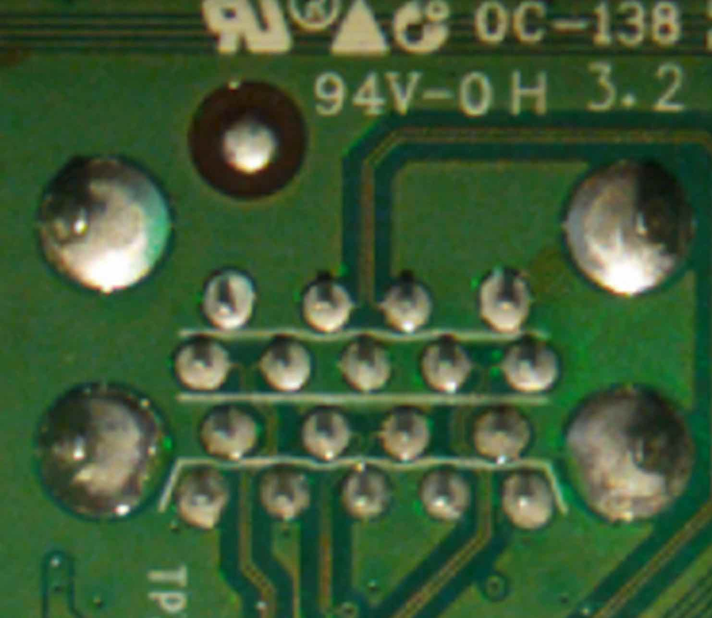
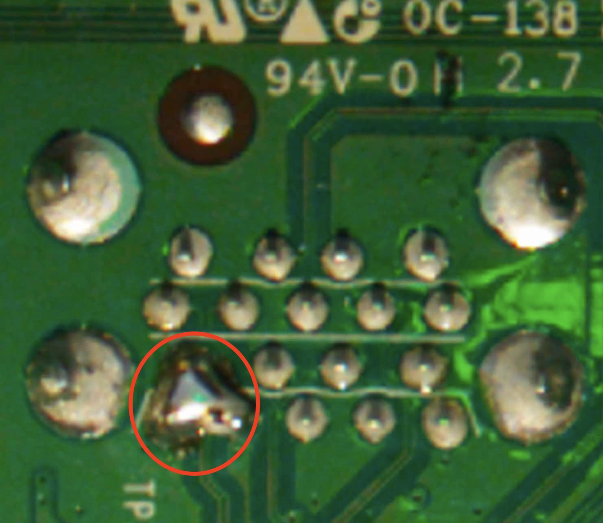
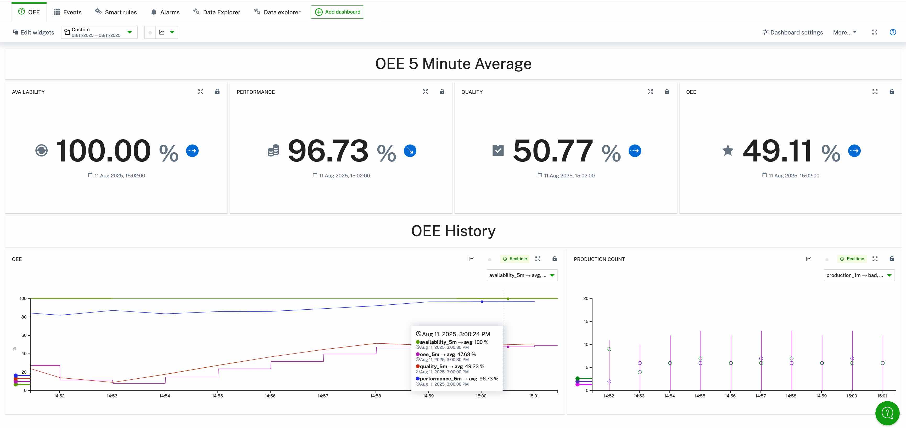

# Solder Quality Classification AI App

This demo shows how you can retrofit easily Vision AI use cases into existing production processes. Taking here the position of a visual quality inspection on a production line. In order to try out the demo you can run the video "solder.mp4" (attached to the release) on a screen and point the camera onto it. Make sure that the camera is facing the video as straight as possible and sees only the video in order to not get disrupted by reflections on your screen.
Using Cumulocity we can combine the vision data with other process data to generate combined value like shown here the calculation of OEE.




## 🤖 Model

The model for this demo is a classification model that recognized different states of a PCB inspection machine (e.g. BACKGROUND, GOOD, NOT_GOOD). The model used is the **"solder-network.zip"**.
> [!IMPORTANT]  
> In Cumulocity when uploading the model into the repository it has to be named "solder" in order to match the AI application,

## 📚 Installing the Analytics

For this example there are three analytics flows. When setting up the camera and installing the AI application a new child-devices will be generated once the first data is sent. Both analytics flows need this new child-devices (default: machine_1) as an input and not the camera device.

## 📈 The Data

### Data of the camera

The AI application will classify what it is seeing and is looking for a pattern of states like BACKGROUND -> GOOD/BAD -> BACKGORUND -> GOOD/BAD -> ...
Several classes of this model are counted as BACKGROUND in this demo.
Every time it enters a new state of GOOD/BAD an event is send to Cumulocity which has the following structure:

```json
{
    "type": "production_event_{{state}}",
    "quality": "{{state}}"
}
```

The ```{{state}}``` will either be GOOD or BAD depedning on the detected class.

### Data of the analytics

The analytics flows of this demo will count the amount of produced items and then uses this data to calculate an OEE (availability is being set fixed to 100% for this demo). The expected production count in the calculation is set to 13. When using the video for this demo that should result into a performance of close to 100%.
All measurements are generated every minute. The OEE calculation metrics are a 5min rolling average.

| Data point | Explanation | Fragment => Series |
| --- | --- | --- |
| **Production Count 1min Total** | The total amount of production count events of the last minute. Created every minute. | production_1m => total |
| **Production Count 1min Good** | The total amount of production count events with quality good of the last minute. Created every minute. | production_1m => good |
| **Production Count 1min Bad** | The total amount of production count events with quality bad of the last minute. Created every minute. | production_1m => bad |
| **Quality 5min** | The 5min rolling average of the percentage of good productions. Created every minute. | quality_5m => avg |
| **Performance 5min** | The 5min rolling average of the percentage of productions (compared to the target of 13/min). Created every minute. | performance_5m => avg |
| **Availability 5min** | Fixed to 100%. Created every minute. | availability_5m => avg |
| **OEE 5min** | The 5min rolling average of Quality x Performance x Availability. Created every minute. | oee_5m => avg |

## 🖼️ Example Dashboard

With the above data you get real-time insights into the OEE of the quality inspection machine for the production line and can display that on a dashboard. Below an example.



## 📦 Debian Package Build

In case you modified the script here is a short guide how to build the debian again.

### Prerequisites

* The `dpkg-deb` utility

### Steps

    From the directory of this README run the following command:
    ```bash
    dpkg-deb --build solder-quality
    ```
    This will create a `solder-quality.deb` file in the current directory.

## ☁️ App Installation

Once you have the Debian package, you can follow the steps from the main README to install the AI application again.