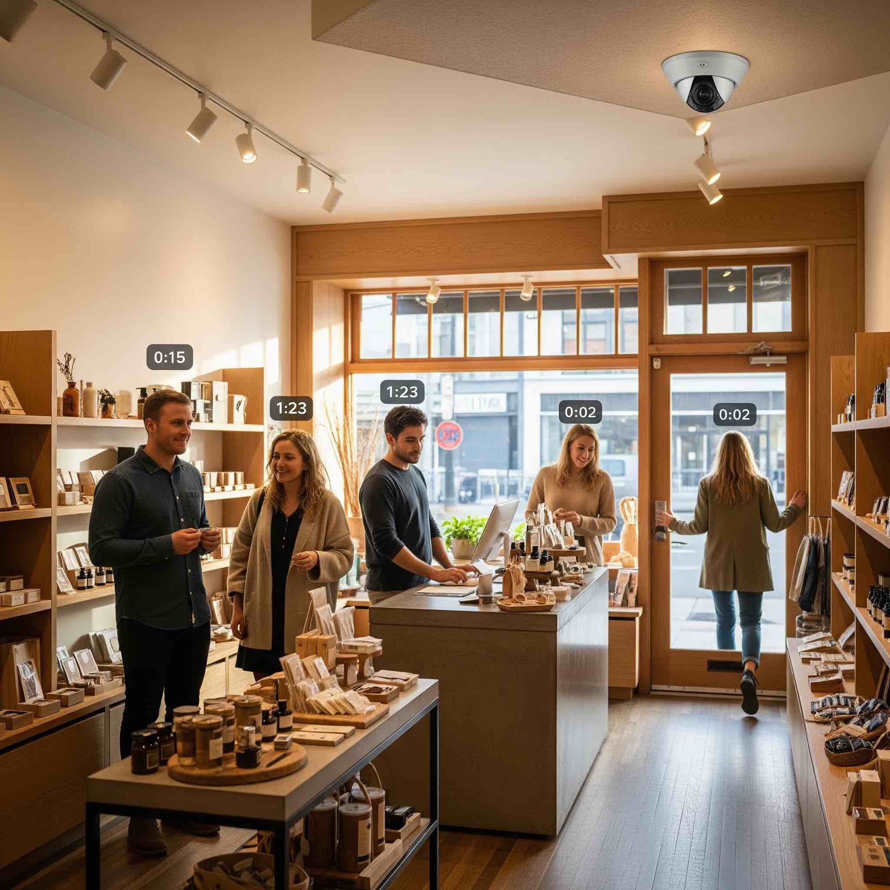

# Time in Store App

This demo shows how you can use Vision AI to analyse how long people are in a certain area. The model is trained to detect people and track their movement throughout the FoV.



## 🤖 Model

The model for this demo is a detection model that recognized people (we will use the same model as for high-vis). The model used is the **"high-vis-network.zip"**.
> [!IMPORTANT]  
> In Cumulocity when uploading the model into the repository it has to be named "highvis" in order to match the AI application,

## 📚 Installing the Analytics

For this example the analytics flow has only the camera as a parameter. Ensure that you select not the Raspberry Pi but the camera child device (as this is where the data is generated).

## 📈 The Data

### Data of the camera

The AI application will track objects while they are in the FoV. When aperson enters the FoV it will start tracking this person and once it leaves the FoV it will send a measurement with the amount of time this person was tracked.
There is no logic to "remember" people if they leave the FoV, therefore if you leave the FoV and re-enter it you are tracked as a "new" person again.

| Data point | Explanation | Fragment => Series |
| --- | --- | --- |
| **Duration** | The time a person was inside the FoV in the camera (Seconds + Milliseconds as fraction). | duration => duration |

### Data of the analytics

The analytics flow of this demo will generate us hourly statistics of the min, max and average duration.

| Data point | Explanation | Fragment => Series |
| --- | --- | --- |
| **Min Duration Current Hour** | The shortest time a person spent in the FoV within the current hour. Resets at the top of the hour. | durationStatistics => minDuration |
| **Min Duration Hour Summary** | The shortest time a person spent in the FoV within the last hour. Created at the top of the hour. | durationStatisticsHourly => minDuration |
| **Max Duration Current Hour** | The longest time a person spent in the FoV within the current hour. Resets at the top of the hour. | durationStatistics => maxDuration |
| **Max Duration Hour Summary** | The longest time a person spent in the FoV within the last hour. Created at the top of the hour. | durationStatisticsHourly => minDuration |
| **Avg Duration Current Hour** | The average time a person spent in the FoV within the current hour. Resets at the top of the hour. | durationStatistics => avgDuration |
| **Avg Duration Hour Summary** | The average time a person spent in the FoV within the last hour. Created at the top of the hour. | durationStatisticsHourly => minDuration |

## 🖼️ Example Dashboard

TODO

## 📦 Debian Package Build

In case you modified the script here is a short guide how to build the debian again.

### Prerequisites

* The `dpkg-deb` utility

### Steps

    From the directory of this README run the following command:
    ```bash
    dpkg-deb --build time-in-store
    ```
    This will create a `time-in-store.deb` file in the current directory.

## ☁️ App Installation

Once you have the Debian package, you can follow the steps from the main README to install the AI application again.